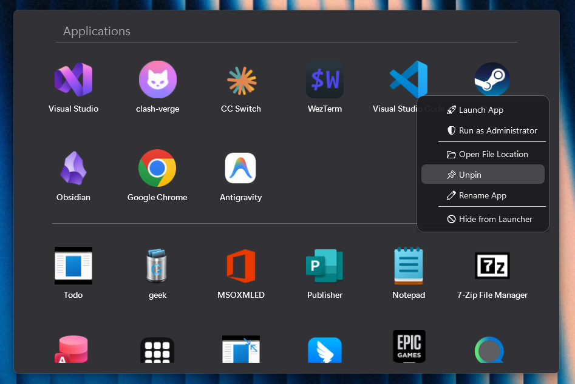
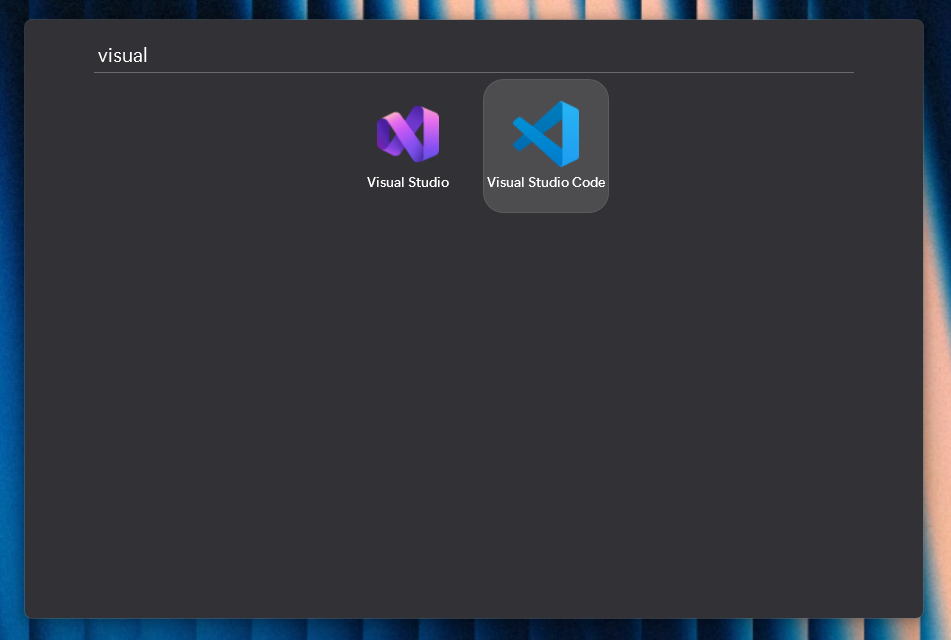

# AppLauncher

**轻量、以本地数据为中心的 Windows 软件启动器。**

> English：[README.md](README.md)

AppLauncher 用键盘和鼠标快速查找、启动本机软件，不需要账号，也不要求维护在线应用目录。它扫描 Windows 本地常见应用位置，在本机保存索引，并常驻通知区域等待调用。

## 下载

[GitHub Releases](https://github.com/iZoy/AppLauncher/releases) 页面用于下载已发布版本。首个稳定版本目标为 `v1.0.0`，提供包含运行时的便携 ZIP：

| 文件 | 适用设备 |
| --- | --- |
| `AppLauncher-v1.0.0-win-x64.zip` | 大多数 Intel/AMD 64 位 Windows 电脑 |
| `AppLauncher-v1.0.0-win-arm64.zip` | Windows ARM64 设备 |

压缩包会自带 .NET 10 运行时，不需要另外安装 .NET。首个版本暂不提供 x86（32 位 Windows）版本，也不计划提供安装器。

首个公开版本暂不提供代码签名，Windows SmartScreen 可能对未签名下载显示警告。请核对页面列出的 SHA-256 校验值，并保持解压后的全部文件位于同一目录。

## 预览





## 系统要求

- Windows 10 1809 或更高版本（推荐 Windows 11）。
- 与下载包匹配的 64 位架构：x64 或 ARM64。
- 便携运行：解压 ZIP 后直接运行 `AppLauncher.exe`。

Windows 11 支持时使用系统 Acrylic 背景；Windows 10 或不支持的系统使用兼容的半透明回退效果。

## 从源码构建

请在 Windows 上安装稳定版 .NET 10 SDK `10.0.400` 或更高的 .NET 10 feature band，然后执行：

```powershell
dotnet restore .\AppLauncher.sln
dotnet build .\AppLauncher.sln -c Release --no-restore
```

本地生成 x64 自包含包：

```powershell
dotnet publish .\AppLauncher.csproj -c Release -r win-x64 --self-contained true
```

ARM64 包将 `-r win-x64` 改为 `-r win-arm64`。构建产物和本机运行数据不会加入 Git。

## 日常操作

### 搜索与启动

- 启动器获得焦点后可直接输入，按应用显示名称或 exe 文件名搜索。
- 按 **Enter** 启动第一个匹配结果。
- 按 **Ctrl+Enter** 或 **Shift+Enter** 以管理员身份启动第一个结果。
- 有搜索内容时按一次 **Esc** 清空搜索；搜索为空时再按一次 **Esc** 隐藏启动器。
- 普通左键点击软件卡片即可启动。

### 应用分区

搜索框为空时，置顶软件显示在普通软件上方，置顶区底部的横线会和列表一起滚动。搜索时所有软件（包括置顶软件）合并为一个结果列表显示。

### 软件右键菜单

右键软件卡片可以：

- 普通启动或以管理员身份启动。
- 打开软件所在文件夹。
- 置顶或取消置顶。
- 修改启动器中的显示名称，不会重命名 exe 文件。
- 从启动器中隐藏软件。

置顶状态、显示名称、隐藏路径和启动次数都会保存在本机，重启后仍然保留。

### 空白区域右键菜单

右键列表空白处可以：

- 添加一个或多个 `.exe` 文件或 Windows 快捷方式（`.lnk`）。
- 扫描并添加包含便携软件的文件夹。
- 执行完整扫描刷新应用列表。

选择文件或重命名对话框打开期间，启动器会保持可见。

### 托盘与窗口行为

- 左键点击托盘图标，显示启动器或将已显示的启动器置于前台。
- 托盘菜单提供语言切换、固定到任务栏和退出。
- 点击启动器外部会自动隐藏；程序仍会保留在托盘中。
- 启动器固定为 900×600，不能缩放。

## 本地数据与隐私

AppLauncher 以本地运行为主：没有账号、遥测、自动更新服务或上传功能。源码中没有用于向外发送数据的网络客户端。应用发现只读取 Windows 本地位置。

运行数据保存在 `%APPDATA%\AppLauncher`：

- `config.json` —— 语言、置顶路径、隐藏路径、自定义名称和其他偏好。
- `app_cache.json` —— 本地发现的应用索引和启动统计。
- `icons_clean\` —— 从本机应用提取的图标。
- `crash.log`、`diagnostic.log` —— 本地故障排查记录；每个文件自动限制为 1 MiB，并最多保留一个轮转副本。

这些文件不在源码仓库或 Release ZIP 中。若要删除设置，请退出 AppLauncher 后手动删除该文件夹。升级时只需替换解压后的程序目录，`%APPDATA%\AppLauncher` 中的数据不会被移动或覆盖。

## 版本说明

这是一个为了分享顺手工具而制作的小型本地启动器。本版本已在 Windows 11 x64 上完成人工验收。Windows 10 和 ARM64 已完成交叉构建与压缩包检查，但本项目尚未进行实体硬件实测。固定到任务栏也可能受到 Windows 策略和系统 Shell 支持影响。

请通过仓库的 [Issues](https://github.com/iZoy/AppLauncher/issues) 页面报告可复现问题。附加日志前，请先删除用户名、应用路径和其他本机信息。

AppLauncher 受到桌面应用启动器启发，与 Apple Inc. 没有关联。本项目不分发 Apple 的字体、图标、截图或代码。

## 许可证

AppLauncher 使用 [MIT License](LICENSE) 发布。项目图标为本项目原创素材。便携压缩包还会包含适用的 .NET Runtime 许可证和第三方声明。
